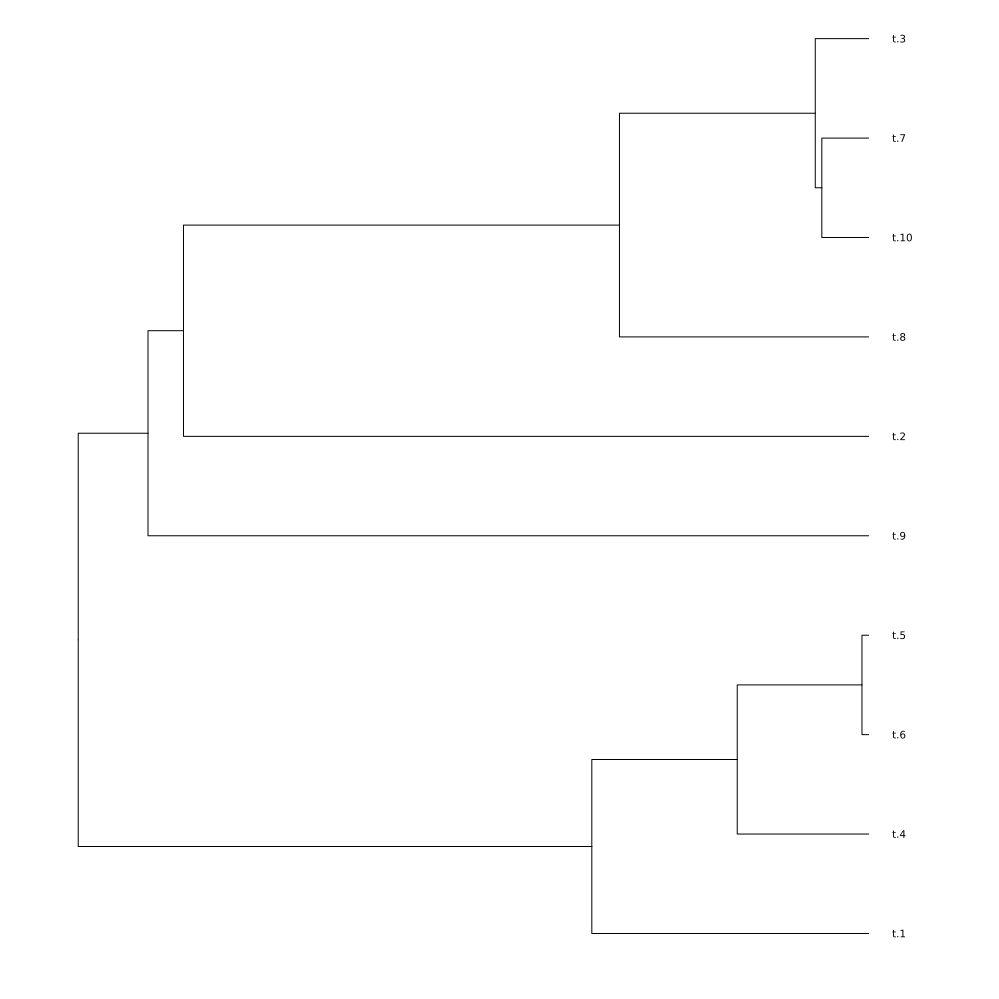
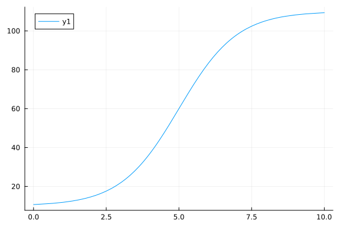
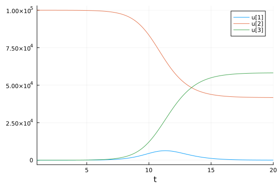
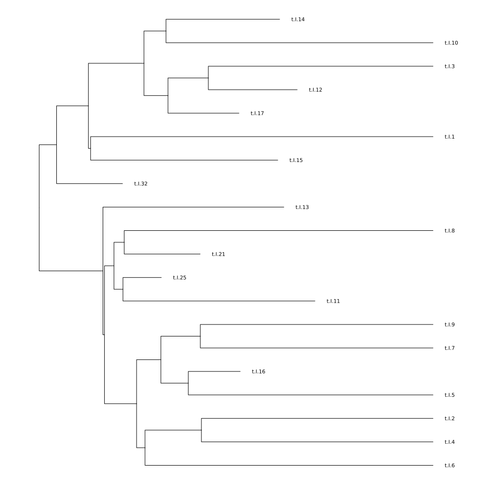
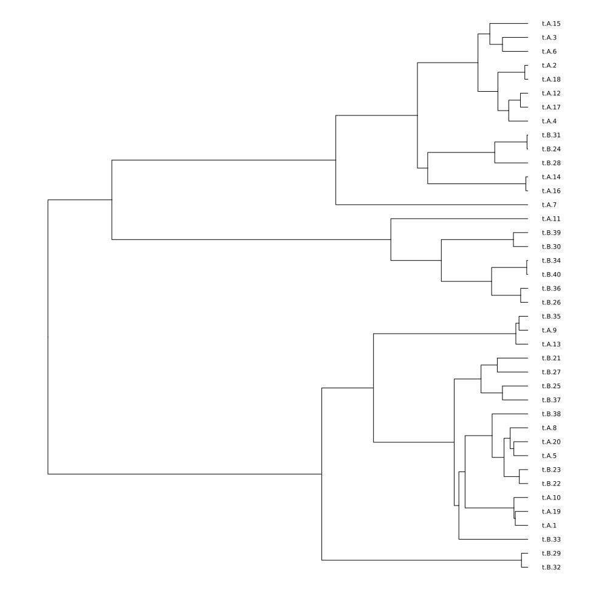
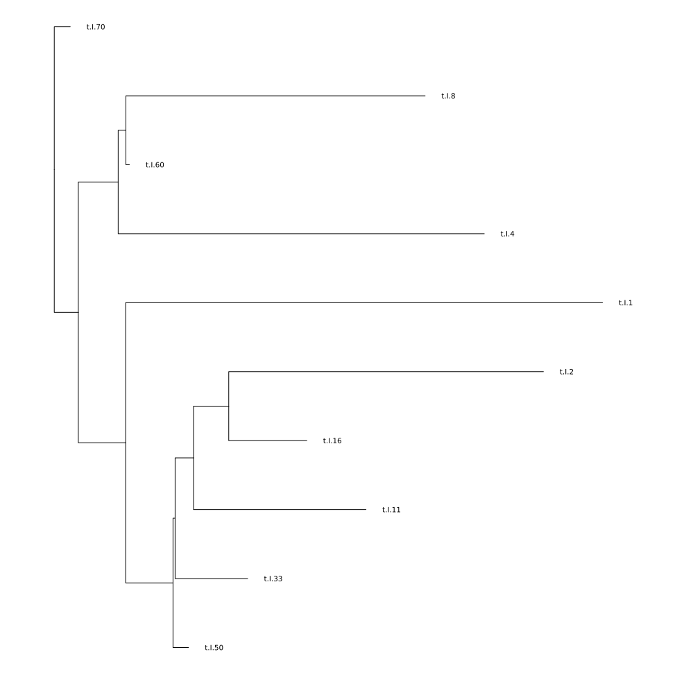

# Introduction

Coalescent.jl is a package for simulation of [coalescent](https://en.wikipedia.org/wiki/Coalescent_theory) genealogical histories with a flexible markup language for conditioning on demographic history. This package can be used as a building-block in pipelines for [simulation-based inference](https://en.wikipedia.org/wiki/Approximate_Bayesian_computation) in population genetics research.  

The focus of this package is on support for simulation under demographic histories featuring nonlinear dynamics, potentially complex state spaces, and complex sampling over time. This makes the package especially relevent for studies of pathogen evolution, but other applications are possible. A design goal of Coalescent.jl is to enable fast and memory-efficient simulation of very large coalescent trees. 

Other software: 

- [msprime](https://tskit.dev/software/msprime.html) A flexible and highly optimised coalescent simulator in Python, but does not currently support complex nonlinear models 
- [phydynR](https://github.com/emvolz-phylodynamics/phydynR) This is an R package which supports similar specification of demographic processes, but is substantially slower  
- [TiPS](https://cran.r-project.org/web/packages/TiPS/index.html) A recently-developed R package supporting a similar specification of demographic processes 
- [MASTER](https://tgvaughan.github.io/MASTER/) A BEAST2 add-on focused on stochastic demographic processes 


Relative to [msprime](), some major features are currently missing: 

- Does not currently support recombination (ancestral recombination graphs) 
- Detailed models of evolution, which currently must be added on manually 


## A simple coalescent simulation

First, let's load the necessary packages:

```julia
using Coalescent
using Phylo # For plotting trees 
using Plots # For plotting demographic trajectories
using Distributions # For random number generation
```


Let's start with a simple coalescent simulation with a constant population size=10 (first argument) and 10 samples:

```julia
tr = SimTree(10.0, 10)
@show tr 
tonewick(tr)
```

```
Simulated coalescent tree with 10 tips and 9 internal nodes
Tip labels:
	Union{Nothing, String}["t.1", "t.2", "t.3", "t.4", "t.5", "t.6", "t.7", "t
.8", "t.9", "t.10"] ...

Rooted; includes branch lengths
tr = 
"((((t.4:2.520073107400519,t.5:2.520073107400519):1.3174591901714678,(t.9:1
.266569944939787,(t.10:0.36999246585678014,(t.1:0.36707169076260365,t.7:0.3
6707169076260365):0.0029207750941764865):0.8965774790830068):2.570962352632
2):2.013564887352403,(t.2:1.6115809554183689,t.8:1.6115809554183689):4.2395
16229506021):5.320626273601084,(t.3:5.617177202174617,t.6:5.617177202174617
):5.554546256350856):0.0;"
```


`tonewick` converts the tree to a portable newick string for loading into other software or packages. 

## Variable Population Size

Now, let's simulate a coalescent with a variable population size:

```julia
tr = SimTree((t,p...)->exp(-t), 10)
```

```
Simulating coalescent, sample size =10
Initial guess of time to most recent common ancestor (before most recent sa
mple): 1.0
Markovian coalescent algorithm
User-specified Ne(t) function 
Simulated coalescent tree with 10 tips and 9 internal nodes
Tip labels:
	Union{Nothing, String}["t.1", "t.2", "t.3", "t.4", "t.5", "t.6", "t.7", "t
.8", "t.9", "t.10"] ...

Rooted; includes branch lengths
```


This creates a tree where the population size increases exponentially over time.
Note that in univariate models, the convention is for time to represent time __before__ the most recent sample. Thus time zero always represents when the most recent sample was collected. 

We can visualize the tree using [Phylo.jl](https://github.com/EcoJulia/Phylo.jl) and [Plots.jl]:

```julia
tonewick(tr) |> parsenewick |> plot
```




## Parametric population size functions

Suppose we wish to specify the growth rate and initial (most recent) population size in the exponential growth model. 

```julia
tr = SimTree((t,Ne0,λ) -> Ne0*exp(-λ*t), 10, 2_000, 0.25)
@show tr 
tonewick(tr) |> parsenewick |> plot
```

```
Simulating coalescent, sample size =10
Initial guess of time to most recent common ancestor (before most recent sa
mple): 2000.0
Markovian coalescent algorithm
User-specified Ne(t) function 
Simulated coalescent tree with 10 tips and 9 internal nodes
Tip labels:
	Union{Nothing, String}["t.1", "t.2", "t.3", "t.4", "t.5", "t.6", "t.7", "t
.8", "t.9", "t.10"] ...

Rooted; includes branch lengths
tr =
```


This simulates a population that starts at size Ne0 and declines exponentially with rate λ. Arguments to `SimTree` folllowing the sample size (10) are passed as arguments to the effective population size function.  So in this case, Ne0=2000 and λ=0.25. 

## Logistic Growth


Here is a tree simulated under logistic growth and carrying capacity K=100:

```julia
nefunc(t,K) = 10 + K*(1/(1+exp(-(t-5))))
plot(t->nefunc(t,100), 0, 10)
```




These simulations are pretty fast, although for unstructured models, there are faster alternatives. This is how long it takes to simulate a tree with 10 thousand samples and the logistic growth model: 

```julia
@time SimTree(nefunc, 10_000, 100)
```

```
Simulating coalescent, sample size =10000
Initial guess of time to most recent common ancestor (before most recent sa
mple): 10.669285092428485
Markovian coalescent algorithm
User-specified Ne(t) function 
  0.600311 seconds (12.49 M allocations: 335.358 MiB, 10.20% gc time, 27.40
% compilation time)
Simulated coalescent tree with 10000 tips and 9999 internal nodes
Tip labels:
	Union{Nothing, String}["t.1", "t.2", "t.3", "t.4", "t.5", "t.6", "t.7", "t
.8", "t.9", "t.10"] ...

Rooted; includes branch lengths
```


## Population Bottleneck

We can simulate a population that experiences a sudden bottleneck. In this case, the effective population size drops from 100 to 1 at time 5. 

```julia
nefunc(t, Ne1,Ne2,T) = t<T ? Ne1 : Ne2
plot(t->nefunc(t, 10.0, 1.0, 5.0), 0, 10)
```


```julia
tr = SimTree(nefunc, 25, 100.0, 1.0, 5.0)
@show tr 
tonewick(tr) |> parsenewick |> plot
```

```
Simulating coalescent, sample size =25
Initial guess of time to most recent common ancestor (before most recent sa
mple): 100.0
Markovian coalescent algorithm
User-specified Ne(t) function 
Simulated coalescent tree with 25 tips and 24 internal nodes
Tip labels:
	Union{Nothing, String}["t.1", "t.2", "t.3", "t.4", "t.5", "t.6", "t.7", "t
.8", "t.9", "t.10"] ...

Rooted; includes branch lengths
tr =
```


## Variable Sampling Times

We can also simulate coalescent trees with samples taken at different times:

```julia
tr = SimTree(1.0, rand(10))
tonewick(tr) |> parsenewick |> plot
```

```
Simulating coalescent, sample size =10
Initial guess of time to most recent common ancestor (before most recent sa
mple): 1.0
Markovian coalescent algorithm
User-specified Ne(t) function
```


The first argument is Ne, and the second argument is a vector sample times, which in this case were 10 uniform random numbers. 


## SIR Model

The specialty of Coalescent.jl is the simulation of trees under non-linear dynamics. 
We'll demonstrate this with the SIR (Susceptible-Infected-Recovered) epidemiological model which is specified by a system of ordinary differential equations. In this case, and in structured models (demonstrated later), there are some important differences regarding how population dynamics are specified: 

- Time now represents the conventional forward direction. This is different than how time is handled in most coalescent software packages (i.e. [msprime](https://tskit.dev/software/msprime.html)), but is necessary to accomodate nonlinear models that are difficult or impossible to solve in retrospective time. 
- Rather than defining the dynamics with a julia expression, we will define the model in YAML format, usually kept in a separate file, but here we will write the YAML as multiline strings. 

```julia
sir_yaml = """
modelname: example_sir
births:
  - source: I # Infections generate new infections at this rate 
    recipient: I 
    rate: β*S*I/N

deaths:
  - deme: I # Representing recovery of infected individuals
    rate: γ*I

parameters:
  - name: β # transmission rate
    value: 3.0
  - name: γ # recovery rate 
    value: 2.0

dynamic_variables:
  - name: I
    initial_value: 1.0
  - name: S
    initial_value: 1e5
    ode: -β*S*I/N
  - name: R
    initial_value: 0.0
    ode: γ*I

helpers: # Other variables that can make it easier to define the ODEs 
  - name: N
    definition: S+I+R

time: 
  initial: 1.0
  final: 20.0 
""";
```


Note that this model schema follows the conventions of so-called [FGY models](https://github.com/mrc-ide/PhyDyn/wiki/Population-Model). Specifically: 

- The genealogical process is defined by several state & time dependant rates that can influence the history of a lineage: Births, Migrations (examples in later sections) and Deaths
- Some dynamical variables correspond to a population size influencing the coalescent rate ("I" in this case representing the number of infections), but others represent the state of the system which must be known to determine birth, migration and death rates ("S" and "R"). We do not decompose dynamics of these variables into birth and death rates, but we must specify an ODE giving the time derivative of these variables. 

Now we integrate the model and plot a trajectory: 

```julia
sirmodel = ModelFGY(confstr = sir_yaml)
@show sirmodel 
soln_sirmodel = solveodes(sirmodel)
plot(soln_sirmodel)
```

```
Compartmental model with 1 demes, 
and 2 other dynamic variables.

Dynamic variables: ["I"], ["S", "R"]

Parameters: 
2×2 DataFrame
 Row │ parameter  value
     │ String     Float64
─────┼────────────────────
   1 │ γ              2.0
   2 │ β              3.0

Initial conditions: Dict{String, Number}("I" => 1.0, "S" => 100000.0, "R" =
> 0.0)
3×2 DataFrame
 Row │ variable  initial value
     │ String    Float64
─────┼─────────────────────────
   1 │ I                   1.0
   2 │ S              100000.0
   3 │ R                   0.0

Initial time: 1.0

Final time: 20.0

sirmodel =
```





Now let's define a sampling scheme. There are several ways to do this. 
Samples can be defined a particular time and a particular deme (see structured models). 
Or julia code can be provided that generates a vector of sample times. Or, a table can be loaded from a file which contains the time and deme of each sample. These can co-exist within the same configuration. Here is an example: 

```julia
sirsample_yaml = """
sample: 
  # Take a single sample from deme I at time 10
  - deme: I
    time: 15.0 
    size: 10
  # Executable Julia code to define sample times. Takes 5 samples from deme I at equal intervals between times 5 and 10. 
  - deme: I
    time: range( 5.0, 10.0, 5 )
  # Another example of parsing and executing Julia code; sampling 5 times from a Normal distribution
  - deme: I
    time: rand( Normal(10), 5 )
  # [NOT RUN] Read sample time information from a table
  #- table: ./sampletimes.csv # A table with columns <sample_time>, <deme>
"""

sirsamp = SampleConfiguration(confstr = sirsample_yaml);
```


Now simulate the tree with the model and sample configuration: 

```julia
tr = SimTree(sirmodel, sirsamp)
tonewick(tr) |> parsenewick |> plot
```




# Models with population structure 

It is straightforward to specify a model with population structure, nonlinear dynamics, and heterogeneous sampling over time using the FGY yaml format. 


## Island Model

First, let's reproduce the classic [island model](https://dyerlab.github.io/applied_population_genetics/population-models.html#the-island-model) with 2 demes, a constant migration rate (μ) between demes, and a constant population size in each deme.

The population size is constant because we specify birth rates and death rates to be the same at a per-capita rate γ.  This rate also sets the timescale of the process (one generation = 1/γ).  


```julia
islandmodel_yaml = """
modelname: exampleisland
births:
  - source: A
    recipient: A
    rate: γ * A
  - source: B
    recipient: B
    rate: γ * B
migrations:
  - source: A 
    recipient: B 
    rate: μ * A 
  - source: B 
    recipient: A 
    rate: μ * B 
deaths:
  - deme: A
    rate: γ * A
  - deme: B
    rate: γ * B
dynamic_variables:
  - name: A
    initial_value: 100.0
  - name: B
    initial_value: 100.0
time:
  initial: 0
  final: 300
parameters:
  - name: γ
    value: 1.0
  - name: μ
    value: 0.05
"""

# Homochronous sampling from both demes: 
islandsample_yaml = """ 
sample:
  - deme: A 
    time: 300
    size: 20 
  - deme: B 
    time: 300
    size: 20 
"""

islandmodel = ModelFGY(confstr=islandmodel_yaml)
@show islandmodel 

# Simulate the tree 
tr = SimTree(
    islandmodel,
    SampleConfiguration(confstr=islandsample_yaml)
)
@show tr 
# Plot the tree: 
tonewick(tr) |> parsenewick |> plot
```

```
Compartmental model with 2 demes, 
and 0 other dynamic variables.

Dynamic variables: ["A", "B"], String[]

Parameters: 
2×2 DataFrame
 Row │ parameter  value
     │ String     Float64
─────┼────────────────────
   1 │ γ             1.0
   2 │ μ             0.05

Initial conditions: Dict{String, Number}("B" => 100.0, "A" => 100.0)
2×2 DataFrame
 Row │ variable  initial value
     │ String    Float64
─────┼─────────────────────────
   1 │ B                 100.0
   2 │ A                 100.0

Initial time: 0.0

Final time: 300.0

islandmodel = 
Simulated coalescent tree with 40 tips and 39 internal nodes
Tip labels:
	Union{Nothing, String}["t.A.1", "t.A.2", "t.A.3", "t.A.4", "t.A.5", "t.A.6
", "t.A.7", "t.A.8", "t.A.9", "t.A.10"] ...

Rooted; includes branch lengths
tr =
```





Note that the deme of sampling is embedded in the tip label, which makes it easy to extract in other software. The deme can also be accessed programmatically in `tr.demes`.


## Imbalanced Migration

The way migration is handled in FGY models is quite different than most coalescent frameworks. The given rate is always a "per-capita" rate in a forwards time direction. 
In contrast, most coalescent frameworks specify a migration rate "per-lineage" in a reverse time direction. To show the difference, consider this variation on the island model which is the same as above except that deme B starts at size 1 and deme A at size 500.  


```julia
twodememigration_yaml = """
modelname: examplemigration
births:
  - source: A
    recipient: A
    rate: γ * A
  - source: B
    recipient: B
    rate: γ * B
migrations:
  - source: A 
    recipient: B 
    rate: μ * A
  - source: B 
    recipient: A 
    rate: μ * B
deaths:
  - deme: A
    rate: γ * A
  - deme: B
    rate: γ * B
dynamic_variables:
  - name: A
    initial_value: 500.0
  - name: B
    initial_value: 1.0
time:
  initial: 0
  final: 50
parameters:
  - name: γ
    value: 1.0
  - name: μ
    value: 0.05
"""

twodememodel = ModelFGY(confstr=twodememigration_yaml)
solntwodeme = solveodes(twodememodel) 
plot(solntwodeme)
```


Because μ is a forward-time per-capita rate, the initial rate of migrations from A to B is 500μ while in the opposite direction it is only 1μ. Thus the populations converge in size over time until the total rate of migrations is the same in both directions. 

If you want to use the per-lineage instead per-capita migration rate, it is possible to deduce the "per-lineage" retrospective rate of migrations. For example in this model, the per-lineage rate from B to A is μA/B and from A to B it is μB/A. See [this paper](https://doi.org/10.1534/genetics.111.134627) for details.  


## A note about initial conditions 

A disadvantage of the FGY model format is that the genealogical process is conditioned on a demographic history, and there is no guarantee that the process will coalesce to a single MRCA by the initial time of the simulation. For most applications, it is desired to simulate until this MRCA is reached.  Consider the previous island model and this sampling scheme: 

```julia
earlyislandsample_yaml = """ 
sample:
  - deme: A 
    time: 1
    size: 20 
  - deme: B 
    time: 1
    size: 20 
""";
```


In this case, all of the samples are collected at time 1 (after the initial time zero), so that there is not time for the process to coalesce. In this case, the simulator will raise a warning and add branches until a MRCA is found based on the distribution of events up to time zero. This is for convenience only, and branches before time zero should not be used for subsequent analysis: 

```julia
julia> SimTree(
           ModelFGY(confstr=islandmodel_yaml),
           SampleConfiguration(confstr=earlyislandsample_yaml)
       )
Simulated coalescent tree with 40 tips and 39 internal nodes
Tip labels:
	Union{Nothing, String}["t.A.1", "t.A.2", "t.A.3", "t.A.4", "t.A.5", "t.A.6", "t.A.7", "t.A.8", "t.A.9", "t.A.10"] ...

Rooted; includes branch lengths

```


```
┌ Warning: Coalescent process did not reach a common ancestor. Adding 34 nodes. 
└ @ Coalescent ~/.julia/packages/Coalescent/kfJsL/src/s0.jl:41
```

If you get this warning, it will likely be important for your application to revise the model to begin simulation from an earlier time point. 


## SEIR Model

Finally, let's simulate a coalescent tree based on the [SEIR](https://en.wikipedia.org/wiki/Compartmental_models_in_epidemiology) (Susceptible-Exposed-Infected-Recovered) model which will illustrate population structure, nonlinear dynamics, and heterochronous sampling:

```julia
seir_yaml = """
modelname: example_sir
births:
  - source: I
    recipient: E
    rate: β*S*I/N
migrations:
  - source: E 
    recipient: I 
    rate: γ₁ * E 
deaths:
  - deme: I
    rate: γ₂ * I
parameters:
  - name: β 
    value: 6.0
  - name: γ₁
    value: 1.0
  - name: γ₂
    value: 1.0
dynamic_variables:
  - name: E
    initial_value: 0.1 
  - name: I
    initial_value: 0.0
  - name: S
    initial_value: 1e3
    ode: -β*S*I/N
  - name: R
    initial_value: 0.0
    ode: γ*I
helpers: 
  - name: N
    definition: S+E+I+R
time: 
  initial: 0.0
  final: 10.0 
"""

seirmodel = ModelFGY(confstr = seir_yaml) 
@show seirmodel
soln_seirmodel = solveodes(seirmodel)
plot(soln_seirmodel)

seirsample_yaml = """
sample:
  - deme: I
    time: range(2.0, 10.0, 10)
"""

seirsamp = SampleConfiguration(confstr = seirsample_yaml) 
tr = SimTree(seirmodel, seirsamp)
@show tr 
tonewick(tr) |> parsenewick |> plot
```

```
Compartmental model with 2 demes, 
and 2 other dynamic variables.

Dynamic variables: ["I", "E"], ["S", "R"]

Parameters: 
3×2 DataFrame
 Row │ parameter  value
     │ String     Float64
─────┼────────────────────
   1 │ γ₁             1.0
   2 │ γ₂             1.0
   3 │ β              6.0

Initial conditions: Dict{String, Number}("I" => 0.0, "S" => 1000.0, "E" => 
0.1, "R" => 0.0)
4×2 DataFrame
 Row │ variable  initial value
     │ String    Float64
─────┼─────────────────────────
   1 │ I                   0.0
   2 │ S                1000.0
   3 │ E                   0.1
   4 │ R                   0.0

Initial time: 0.0

Final time: 10.0

seirmodel = 
Simulated coalescent tree with 10 tips and 9 internal nodes
Tip labels:
	Union{Nothing, String}["t.I.1", "t.I.2", "t.I.4", "t.I.8", "t.I.11", "t.I.
16", "t.I.33", "t.I.50", "t.I.60", "t.I.70"] ...

Rooted; includes branch lengths
tr =
```





In this model, lineages are sampled from the "I" deme, representing for example microbial genomes collected from symptomatic infected individuals. Migration represents the progression of disease "E" to "I". Deaths represent recovery of infected individuals. And "I" lineages generate new lineages in "E" (forwards time) according to a mass action model. 

## Computing Distances

For some applications related to simulation-based inference, it may be better to work with a distance matrix rather than the tree. We can compute this matrix as follows:

```julia
tr = SimTree(seirmodel, seirsamp, computedescendants=true)
# You can modify `tr.edgelength` to simulate various evolutionary models
Coalescent.distancematrix(tr)
```

```
10×10 Matrix{Float64}:
  0.0      14.9448   12.7552   …  8.09323  8.3108   8.72257  8.30531
 14.9448    0.0      13.167       9.61146  8.72257  6.75937  7.41642
 12.7552   13.167     0.0         7.42192  5.02444  6.94479  6.52753
 11.835    12.2781   10.0886      6.50165  5.64414  6.05591  5.63864
 10.1032   11.3892    9.19969     4.76983  4.75525  5.16702  4.74975
  6.81885  10.5003    8.3108   …  3.64878  3.86636  4.27813  3.86086
  8.09323   9.61146   7.42192     0.0      2.97747  3.38924  2.97197
  8.3108    8.72257   5.02444     2.97747  0.0      2.50035  2.08309
  8.72257   6.75937   6.94479     3.38924  2.50035  0.0      1.1942
  8.30531   7.41642   6.52753     2.97197  2.08309  1.1942   0.0
```


Note that the simulator must be called with `computedescendants=true` in this case which will add modestly to simulation time and substantially to memory usage. 
If you wish to simulate an evolutionary model, so that for example distances represent substitutions per site, you can modify the branch lengths (`tr.edgelength`) before computing the distance matrix. For example, this would simulate a Jukes-Cantor model with substitution rate 0.001 and 10,000 nucleotides: 

```julia
tr.edgelength .= [ Poisson(rate) |> rand for rate in tr.edgelength*10_000*0.001  ]
```

```
18-element Vector{Union{Nothing, Float64}}:
 58.0
  8.0
  7.0
 33.0
 11.0
  7.0
  1.0
 30.0
  6.0
 47.0
  0.0
  3.0
  3.0
 59.0
  5.0
  5.0
  2.0
  2.0
```


Future versions may streamline this simulation. 
